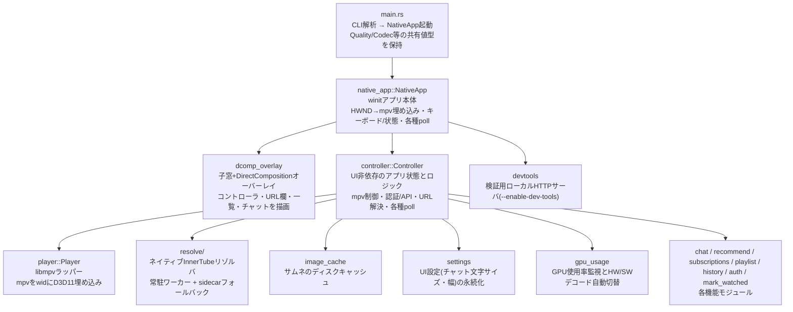

# アーキテクチャ概要

対象読者: このコードベースを初めて触る人、モジュール間の責務分担を確認したい人。

## モジュールマップ

機能ごとの詳細は [docs/features/](../features/) を参照。ここでは横断的な設計方針だけを扱う。

## 設計原則

### 1. UI 非依存コア（Controller）

状態とロジックはすべて `Controller` に集約され、フロントエンド（描画/入力）から分離されている。
現状フロントエンドは `native_app` + `dcomp_overlay` の 1 種類のみだが、将来的に別のフロントエンドを
被せる場合も `Controller` 自体の変更は不要という前提で設計されている。

`Controller` が持つ主な責務:
- mpv (`Player`) の制御（再生/一時停止/シーク/画質切替/HWデコード切替）
- 認証状態（トークン・チャンネル名）とその API 呼び出し
- URL 解決のディスパッチと結果待ち（起動直後は「サイレントログイン完了まで解決を保留する」レースガードを持ち、
  匿名解決がメンバー限定動画をロックしてしまうのを防ぐ）
- 各一覧（おすすめ/登録新着/履歴/再生リスト）・チャットのバックグラウンド取得結果の受信

### 2. 描画とレンダリングの分離

動画は mpv が D3D11 でウィンドウへ直接描画する。UI（コントローラ・一覧・チャット）は別の透過子窓に
DirectComposition 経由で描画する。**両者は GPU コンテキストを共有しない**。チャット表示時は mpv の
`video-margin-ratio-right` プロパティで動画の描画領域自体を左に縮め、空いた右側にチャットパネルを描く
（オーバーレイの重ね描きではなく、真の左右分割）。

レンダリング方式そのものの設計判断（なぜ DirectComposition か、なぜ OpenGL/egui を廃止したか）は
[overlay-rendering.md](overlay-rendering.md) を参照。

### 3. I/O はすべてバックグラウンドスレッド + mpsc

API 呼び出し・URL解決・チャットポーリング・サムネ取得など、ブロッキングしうる処理はすべて別スレッドで実行し、
結果は `std::sync::mpsc::channel` でメインスレッドへ送る。完了時は winit の `EventLoopProxy` で
`UserEvent::Background` を送出してイベントループを起こす（ポーリングではなくプッシュ通知でメインループを
起床させる）。これにより winit のメインループは常駐スレッドを一切ブロックせず、CPU バウンドなイベント処理に
専念できる。

各バックグラウンド系（認証・チャット・おすすめ・登録新着・履歴・再生リスト・URL解決）は独立したチャンネルを持ち、
`Controller` がそれぞれの `try_recv()` をイベントループの tick ごとに回す。

### 4. 撤去済みの旧設計

- **OpenGL Render API + egui**: 単一 GL コンテキストでの合成方式。起動時の OpenGL ドライバ bring-up が
  他アプリの GPU 再生を一瞬妨げる問題があり撤去。詳細は [inbox/opengl-to-native-migration.md](../../inbox/opengl-to-native-migration.md)。
- **`WS_EX_LAYERED` + `UpdateLayeredWindow` オーバーレイ**（旧 `native_overlay.rs`）: 子窓+DirectComposition
  方式に置き換えて撤去。詳細は [overlay-rendering.md](overlay-rendering.md)。
- **yt-dlp.exe の逐次起動によるURL解決**: 常駐ネイティブリゾルバに置き換えて撤去（バイナリも配布物から除去済み）。
  詳細は [url-resolution.md](url-resolution.md)。

## 関連ドキュメント

- [url-resolution.md](url-resolution.md) — ネイティブ InnerTube リゾルバの設計
- [overlay-rendering.md](overlay-rendering.md) — DirectComposition オーバーレイの設計
- [auth-backend.md](auth-backend.md) — OAuth と Cloudflare Worker バックエンドの設計
- [threading-and-io.md](threading-and-io.md) — スレッドモデルと mpsc 配線の詳細
