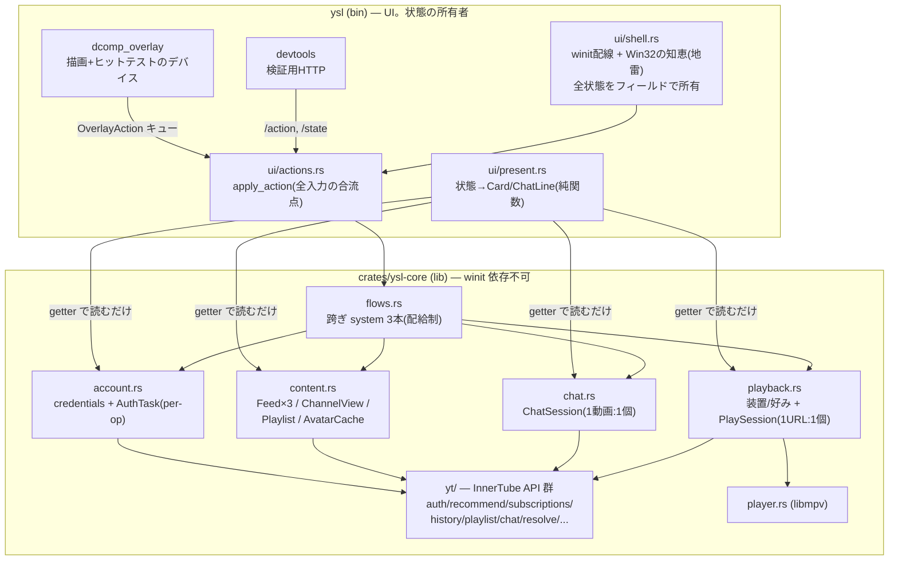

# 設計原則 — 何を実装するときも従うもの

このドキュメントは、機能追加・リファクタ・バグ修正のいずれにも適用される恒久的な原則。
[Issue #11](https://github.com/cancer/youtube-super-lite/issues/11) の再編工事はこの原則への
移行作業であり、工事完了後もこの文書だけが規範として残る
(工事中の具体的手順は [inbox/issue11-implementation-guide.md](../../inbox/issue11-implementation-guide.md))。

## なぜこの原則が要るのか — このリポジトリで実際に起きたこと

原則は美学ではなく、**実際に起きた腐敗の再発防止策**。過去に3つの境界違反が起きた:

1. **UI の関心事がコア(Controller)に混入** — 表示フラグ・表示文言をコアが持ち、
   フロントエンド刷新後に誰も読まないデッドフィールド11個として残存した
2. **アプリの判断が UI(native_app)に混入** — 「画質を変えたら再解決する」等の判断が
   入力経路ごとにコピペされ(3系統)、コピー同士の挙動がドリフトした
3. **コアが UI フレームワークの型(winit の EventLoopProxy)を保持** —
   「UI 非依存コア」という文書上の約束が実は成立していなかった

3件に共通するのは「**ルールは文書化されていたが、コンパイルは通るので破れた**」こと。
よって原則は可能な限り、規律ではなく **Rust の言語機能(privacy・所有権・借用・クレート依存)で
機械的に強制する**形にしてある。

## 原則1: データと振る舞いを分離する

- **データはただの構造体**。状態フィールドだけを持ち、ロジックのメソッドを持たない。
  読み取り用 getter(`items()`, `is_busy()`)だけは可(Rust にフィールドの読み取り専用公開が
  ないための代替であり、振る舞いではなくアクセス制御)
- **振る舞いはモジュールの関数**。毎 tick 走って状態を取り込む関数群を **system** と呼ぶ

```rust
// データ: 状態だけ
pub struct Feed<T> { items: Vec<T>, rx: Receiver<FeedUpdate<T>>, busy: bool, /* private */ }

// 振る舞い: 同モジュールの関数
pub fn poll_feed<T>(f: &mut Feed<T>) -> bool { /* rx を drain */ }
```

**struct を作ってよい条件**: 同時に変化し・1つの不変条件を共有するフィールドの束
(= 1つの状態機械)だけを struct にする。「関連するものの集まり」(カテゴリ)は
**モジュール**で表し、袋 struct にしない — 袋にすると、その一部しか触らない関数の
シグネチャが袋全体を要求することになり、原則3(依存の明示)の解像度が落ちる。
例: `Account`(ログインのライフサイクル)は状態機械なので struct。content ドメインの
「4つのフィード + playlist + avatars」は独立した機械の集まりなので、束ねる `Content` 型は
作らず、shell が個別に所有する。

**インスタンスの寿命は現実の寿命に合わせる**: 再生セッションは 1 URL に 1 個、チャット接続は
1 動画に 1 個 — per-use のものは **use ごとに生成して捨てる**(`Option<PlaySession>` を丸ごと
差し替える等)。アプリ寿命の struct に押し込めて使い回すと「開始のたびにフィールドを並べて
初期化し直す儀式」が必要になり、リセット漏れ = 前回の状態が今回に漏れるバグの温床になる。
**手動リセットの儀式を書いたら per-use インスタンス化の信号**。付随する利点:
停止処理は `Drop` に書けて(RAII)、mpsc チャネルをインスタンスごとに作れば
「前セッション宛の遅延メッセージ」が破棄済み rx と共に構造的に死ぬ。
アプリ寿命が正しいのは、装置(mpv、常駐リゾルバ)・ユーザー設定(quality/codec)・
アプリ全体につき1つの事実(ログイン中の identity)だけ。

**Why**: データと振る舞いを型に同梱する(クラス的)設計では、型が育つほど「その型の中なら
何でも書ける」領域が広がる。旧 Controller(62 フィールド + 800 行の impl)はその終着点。
分離すれば、振る舞いの追加はデータを触らず、データの追加は既存の振る舞いを触らない。

## 原則2: 情報隠蔽 — 書き手を同モジュールに限定する

- データ構造体のフィールドは **private**。書き換えられるのは**同じモジュールの system 関数だけ**
- 貰った側(shell や flows)は箱を開けられない。getter で読むか、system 関数に貸すかのどちらか
- `&mut` を返す getter は禁止(この原則の脱法になる)

**Why**: 「どこからでも書ける状態」が違反1・2の温床だった。Rust のモジュール privacy は
これをコンパイルエラーにできる、無料で最強の壁。

## 原則3: 依存は引数で明示する

- 関数は触る状態を**シグネチャに全部列挙**する。環境的に取得できる共有状態
  (グローバル、シングルトン、DI コンテナ、World 的な万能ストア)を**作らない**
- ドメインモジュール(account / playback / content / chat)は**互いに import しない**。
  跨ぐデータ(トークン、video_id、再生位置)は呼び出し側が値で運ぶ
- 複数ドメインを触る関数は **flows.rs にしか置けない**(ドメイン間 import 禁止の帰結)。
  現在3本。**4本目を足すときは Issue で相談** — 跨ぎ関数の本数はアプリの結合量の記録であり、
  ここにロジックが無制限に積み上がると「万能アクセス + ロジックの集積」= God Class の再誕になる

```rust
// この関数が Chat に指一本触れないことを、シグネチャがコンパイラの保証つきで語る
pub fn on_logged_in(acc: &Account, pb: &mut Playback, ct: &mut Content, waker: &Waker)
```

**Why**: 影響範囲がシグネチャを読むだけで分かる。borrow checker が disjoint な `&mut` を
検査するので、アクセスの衝突も機械検出される。

## 原則4: 境界を渡る参照は ID にする

- レイヤーやドメインを跨いで何かを指すときは、参照・index(位置)・データのコピーではなく
  **安定した ID**(video_id / channel_id / playlist_id)を渡す
- ドメインには YouTube が本物の ID をくれているので、合成 ID は不要

**Why**: 位置(`PlayIndex(usize)`)は「その瞬間の描画順の座席番号」で、描画と操作の間に
一覧が更新されると別の対象を指す(実バグ源)。参照(`&mut`)の長期保有は Rust では
そもそも書けない(共有×可変の禁止)。ID は失効せず、必要なときに必要な側面だけ引ける。

## 全体構造 — レイヤーはクレートで強制する



- **lib は winit を知らない**(Cargo.toml に依存が存在しないため import 不能)。
  違反①③の再発をコンパイラが拒否する、この設計で唯一のクレート境界
- ドメイン(account / playback / content / chat)は**互いに矢印がない** = import しない(原則3)。
  跨ぐ処理は flows にしか存在できない
- 背景スレッドからの起床通知は `Waker`(`Arc<dyn Fn() + Send + Sync>`)を bin から注入する
- 状態の**所有**は shell(bin の NativeRunning)。所有 ≠ 知識: shell は箱を抱えて貸すだけで、
  中身の操作はできない(原則2)。present は getter による読み取り専用

## 「どこに置くか」の判定

新しいコードを書くとき、置き場は次の質問で決まる:

1. 画面のデザインを変えたら書き直すか? → **bin(ui)**
2. YouTube の仕様が変わったら書き直すか? → **lib(yt/ またはドメイン)**
3. 2つ以上のドメインの状態を触るか? → **flows**(ただし4本目は Issue で相談)
4. どれでもない(OS・ウィンドウの挙動の話)? → **shell**。触る前にレビュー依頼

## 出自について

この4原則は特定のフレームワーク由来ではない基礎
(構造化プログラミングのモジュール分割と情報隠蔽、リレーショナルモデルのキー参照、
functional core / imperative shell)。ECS やデータ指向設計(DoD)は同じ核を持つ隣人だが、
それらのゲーム的ワークロード(大量オブジェクト × 動的合成 × 毎フレーム走査)向けの機構
(World・Entity 台帳・archetype 索引)は、本アプリに素材がないため採用しない。
Rust はこの基礎を言語機能として持つため、**フレームワークを追加せず素の言語だけで実現する**。
